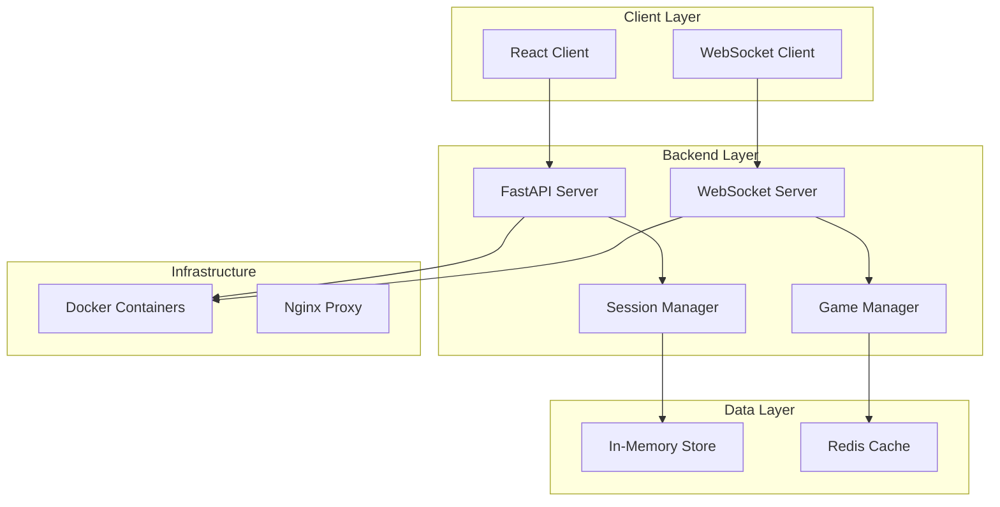
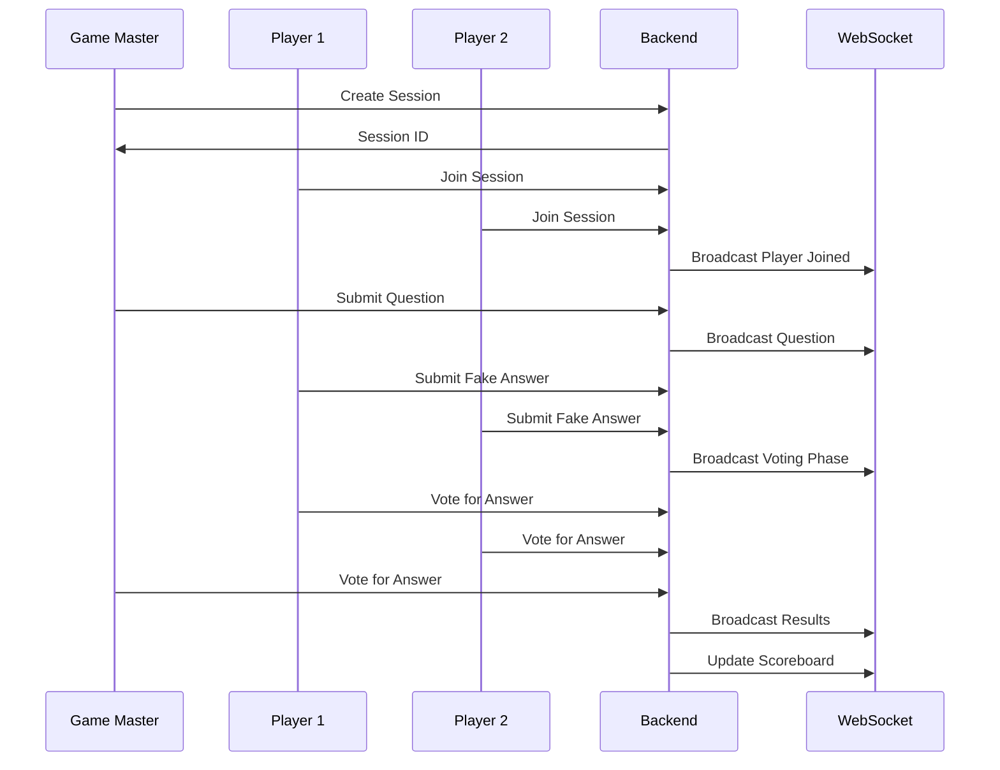

# Design Document

## Overview

"Le mauvais choix" is a real-time multilingual web application consisting of a FastAPI backend with WebSocket support and a React frontend with full internationalization. The system manages multiple concurrent game sessions where players submit deceptive answers and vote on responses. The architecture emphasizes real-time communication, session management, internationalization support for English and French, enhanced animations for user engagement, and scalable deployment through Docker containers.

## Architecture

### System Architecture



### Component Interaction Flow



## Components and Interfaces

### Backend Components

#### 1. FastAPI Application (`app/main.py`)
- **Purpose**: Main application entry point and HTTP API endpoints
- **Responsibilities**:
  - Session creation and management
  - Player registration
  - Game state transitions
  - Score calculation
- **Key Endpoints**:
  - `POST /sessions` - Create new game session
  - `POST /sessions/{session_id}/join` - Join existing session
  - `GET /sessions/{session_id}/state` - Get current game state
  - `POST /sessions/{session_id}/questions` - Submit question (game master only)
  - `POST /sessions/{session_id}/answers` - Submit fake answer
  - `POST /sessions/{session_id}/votes` - Submit vote
  - `POST /question-sets/upload` - Upload CSV question file
  - `GET /question-sets` - List available question sets
  - `DELETE /question-sets/{set_id}` - Delete question set
  - `POST /sessions/{session_id}/auto-mode` - Enable automatic game master mode
  - `POST /sessions/{session_id}/dice-question` - Get random question with dice
  - `PUT /sessions/{session_id}/edit-question` - Edit current question (dice mode)

#### 2. WebSocket Manager (`app/websocket.py`)
- **Purpose**: Real-time communication with clients
- **Responsibilities**:
  - Connection management
  - Message broadcasting
  - Session-specific messaging
- **Key Methods**:
  - `connect(websocket, session_id, player_id)`
  - `disconnect(websocket, session_id, player_id)`
  - `broadcast_to_session(session_id, message)`
  - `send_to_player(session_id, player_id, message)`

#### 3. Game Session Manager (`app/models/session.py`)
- **Purpose**: Game session state management
- **Responsibilities**:
  - Session lifecycle management
  - Player management
  - Game state transitions
  - Automatic game master mode management
- **Key Classes**:
  ```python
  class GameSession:
      session_id: str
      game_master_id: str
      players: Dict[str, Player]
      current_question: Optional[Question]
      game_state: GameState
      scores: Dict[str, int]
      is_automatic_mode: bool
      question_set_id: Optional[str]
      used_questions: Set[int]  # Track used question indices
  
  class Player:
      player_id: str
      pseudonym: str
      is_game_master: bool
  
  class Question:
      text: str
      correct_answer: str
      fake_answers: Dict[str, str]  # player_id -> fake_answer
      votes: Dict[str, str]  # player_id -> voted_answer
      source: str  # "manual", "csv", "dice"
  ```

#### 4. Question Management System (`app/models/questions.py`)
- **Purpose**: CSV question file management and random selection
- **Responsibilities**:
  - CSV file parsing and validation
  - Question set storage and retrieval
  - Random question selection with dice functionality
- **Key Classes**:
  ```python
  class QuestionSet:
      set_id: str
      name: str
      category: str
      questions: List[QuestionData]
      created_at: datetime
      file_path: str
  
  class QuestionData:
      question: str
      answer: str
      category: Optional[str]
      difficulty: Optional[str]
  
  class QuestionManager:
      def parse_csv(self, file_content: str) -> QuestionSet
      def get_random_question(self, set_id: str, exclude_indices: Set[int]) -> Tuple[QuestionData, int]
      def validate_csv_format(self, file_content: str) -> bool
  ```

#### 5. Automatic Game Master (`app/services/auto_gm.py`)
- **Purpose**: Automated game master functionality
- **Responsibilities**:
  - Automatic question progression
  - Timer management for phases
  - Score calculation and progression
- **Key Methods**:
  ```python
  class AutoGameMaster:
      def start_automatic_session(self, session_id: str, question_set_id: str)
      def progress_to_next_question(self, session_id: str)
      def handle_phase_timeout(self, session_id: str, phase: GameState)
      def calculate_and_broadcast_results(self, session_id: str)
  ```

#### 6. Game State Machine (`app/models/game_state.py`)
- **Purpose**: Manage game flow and state transitions
- **States**:
  - `WAITING_FOR_PLAYERS`
  - `QUESTION_PHASE`
  - `SUBMISSION_PHASE`
  - `VOTING_PHASE`
  - `RESULTS_PHASE`
  - `GAME_ENDED`
  - `AUTO_MODE_SETUP`  # New state for automatic mode configuration

### Frontend Components

#### 1. App Component (`src/App.js`)
- **Purpose**: Main application container and routing
- **Responsibilities**:
  - WebSocket connection management
  - Global state management including language preferences
  - Route handling
  - Responsive layout management
  - Internationalization context provider
  - "Le mauvais choix" branding display

#### 2. Layout Components
- `GameSidebar.js` - Fixed sidebar with game ID, player list, and navigation
- `MainContent.js` - Responsive main content area with proper mobile handling
- `MobileHeader.js` - Collapsible header for mobile devices
- `ResponsiveContainer.js` - Wrapper for responsive behavior across components

#### 3. Session Components
- `JoinSession.js` - Session joining interface with mobile-optimized form
- `CreateSession.js` - Session creation interface with responsive design
- `GameLobby.js` - Pre-game player list with animated player additions

#### 4. Game Components
- `QuestionPhase.js` - Display question and collect fake answers with improved layout
- `VotingPhase.js` - Display all answers and collect votes with game master controls
- `ResultsPhase.js` - Show voting results and scores with animations
- `Scoreboard.js` - Current game scores display with animated updates

#### 5. Game Master Components
- `GameMasterPanel.js` - Enhanced game master controls with voting management
- `QuestionSubmission.js` - Question and answer input form with better UX
- `VotingControls.js` - Dedicated voting phase controls for game master
- `DiceQuestionSelector.js` - Random question selection with edit capability
- `AutoModeSetup.js` - Configuration interface for automatic game master mode

#### 6. Question Management Components
- `QuestionSetManager.js` - Upload, view, and manage CSV question files
- `CSVUploader.js` - Drag-and-drop CSV file upload with validation
- `QuestionSetSelector.js` - Select question set for automatic mode
- `QuestionPreview.js` - Preview questions from CSV files with validation feedback

#### 7. Automatic Mode Components
- `AutoGameMasterInterface.js` - Simplified interface for automatic mode sessions
- `AutoModeProgress.js` - Progress indicators and timing for automatic phases
- `AutoModeControls.js` - Override controls for automatic mode (pause, skip, etc.)

#### 8. Animation and UI Components
- `AnimatedTransition.js` - GSAP-powered transitions between game phases with enhanced effects
- `LoadingSpinner.js` - Animated loading states with "Le mauvais choix" branding
- `NotificationToast.js` - Enhanced animated notifications for game events (player joins, interactions)
- `ProgressIndicator.js` - Animated progress bars and counters with smooth transitions
- `DiceAnimation.js` - Animated dice roll effect for random question selection
- `ResponsiveGrid.js` - CSS Grid component that adapts to screen size and content
- `FullWidthContainer.js` - Container that uses all available horizontal space
- `InteractionFeedback.js` - Immediate visual feedback for user interactions
- `ScoreAnimation.js` - Smooth score update animations with celebration effects
- `PhaseTransition.js` - Enhanced phase change animations with engaging visual effects

#### 9. Internationalization Components
- `LanguageSelector.js` - Corner-positioned language toggle between English and French
- `TranslatedText.js` - Component for displaying translated text with fallbacks
- `LocalizedButton.js` - Button component with translated labels
- `LocalizedForm.js` - Form components with translated placeholders and validation messages

## Internationalization Architecture

### Language Management System
- **Supported Languages**: English (en) and French (fr)
- **Default Language**: English
- **Storage**: Browser localStorage for persistence
- **Fallback Strategy**: English text if French translation missing
- **Context Provider**: React Context for global language state management

### Translation Structure
```javascript
// Translation files: src/locales/en.json, src/locales/fr.json
{
  "app": {
    "title": "Le mauvais choix",
    "subtitle": "The Wrong Choice Game"
  },
  "navigation": {
    "home": "Home",
    "join": "Join Game",
    "create": "Create Game"
  },
  "game": {
    "phases": {
      "waiting": "Waiting for players...",
      "question": "Question Phase",
      "submission": "Submit your fake answer",
      "voting": "Vote for the correct answer",
      "results": "Round Results"
    },
    "actions": {
      "submit": "Submit",
      "vote": "Vote",
      "next_round": "Next Round",
      "end_voting": "End Voting"
    },
    "notifications": {
      "player_joined": "{playerName} joined the game",
      "answer_submitted": "Answer submitted successfully",
      "vote_recorded": "Vote recorded"
    }
  },
  "forms": {
    "session_id": "Session ID",
    "pseudonym": "Your Name",
    "question": "Question",
    "answer": "Correct Answer"
  }
}
```

### Language Selector Design
- **Position**: Fixed in top-right corner
- **Style**: Compact toggle button (EN/FR)
- **Behavior**: Immediate language switch with smooth transition
- **Persistence**: Saves preference to localStorage
- **Visual Feedback**: Highlight active language

## Enhanced Animation System

### Animation Framework Architecture
- **Primary Library**: GSAP (GreenSock Animation Platform)
- **Performance**: Hardware-accelerated transforms, 60fps target
- **Accessibility**: Respects user's reduced motion preferences
- **Modularity**: Reusable animation utilities and presets

### Animation Categories

#### 1. Interaction Animations
- **Button Hover/Click**: Scale and color transitions
- **Form Submission**: Loading states with progress indicators
- **Answer Selection**: Highlight and selection feedback
- **Vote Submission**: Confirmation animations

#### 2. Game Flow Animations
- **Phase Transitions**: Smooth slide/fade between game phases
- **Player Join/Leave**: Animated list updates with stagger effects
- **Question Reveal**: Typewriter or slide-in effects
- **Results Display**: Sequential reveal of vote counts and scores

#### 3. Notification Animations
- **Toast Messages**: Slide-in from corner with auto-dismiss
- **Player Actions**: Real-time feedback for submissions and votes
- **Score Updates**: Bouncing numbers and highlight effects
- **Achievement Celebrations**: Confetti or particle effects for high scores

#### 4. Loading and Progress Animations
- **Connection Status**: Pulsing indicators for WebSocket state
- **Submission Progress**: Real-time counters with smooth updates
- **Timer Countdowns**: Animated progress bars and number displays
- **Loading States**: Branded spinners with "Le mauvais choix" elements

### Animation Performance Optimization
- **GPU Acceleration**: Use transform3d and will-change properties
- **Batch Updates**: Group DOM changes to minimize reflows
- **Reduced Motion**: Detect and respect prefers-reduced-motion
- **Memory Management**: Proper cleanup of animation instances

## Data Models

### Session Storage Structure
```python
# In-memory session store
sessions = {
    "session_id": {
        "game_master_id": "player_uuid",
        "players": {
            "player_uuid": {
                "pseudonym": "PlayerName",
                "is_game_master": bool,
                "connected": bool
            }
        },
        "current_question": {
            "text": "Question text",
            "correct_answer": "Correct answer",
            "fake_answers": {
                "player_uuid": "fake_answer"
            },
            "votes": {
                "player_uuid": "voted_answer"
            },
            "source": "manual|csv|dice",
            "original_text": "Original question before editing",
            "original_answer": "Original answer before editing"
        },
        "game_state": "VOTING_PHASE",
        "scores": {
            "player_uuid": 15
        },
        "round_number": 3,
        "is_automatic_mode": false,
        "question_set_id": "uuid-of-question-set",
        "used_questions": [1, 5, 12],  # Indices of used questions
        "auto_timers": {
            "submission_timeout": 60,
            "voting_timeout": 30,
            "results_display": 10
        }
    }
}

# Question sets storage
question_sets = {
    "set_uuid": {
        "name": "General Knowledge",
        "category": "Mixed",
        "questions": [
            {
                "question": "What is the capital of Argentina?",
                "answer": "Buenos Aires",
                "category": "Geography",
                "difficulty": "Easy"
            }
        ],
        "created_at": "2025-01-01T00:00:00Z",
        "file_path": "/uploads/general_knowledge.csv"
    }
}
```

### WebSocket Message Format
```json
{
    "type": "GAME_STATE_UPDATE",
    "data": {
        "game_state": "VOTING_PHASE",
        "question": "What is the capital of Mars?",
        "answers": ["New Tokyo", "Olympia", "Red City", "Marsopolis"],
        "time_remaining": 30,
        "players_submitted": 3,
        "total_players": 4,
        "is_automatic_mode": false,
        "question_source": "dice",
        "animation_trigger": "phase_transition"
    }
}

{
    "type": "PLAYER_JOINED",
    "data": {
        "player_name": "Alice",
        "player_count": 4,
        "animation_trigger": "player_join"
    }
}

{
    "type": "INTERACTION_FEEDBACK",
    "data": {
        "action": "answer_submitted",
        "player_id": "uuid",
        "animation_trigger": "submission_success"
    }
}

{
    "type": "DICE_QUESTION_SELECTED",
    "data": {
        "question": "What are the 12 biggest cities in Argentina?",
        "answer": "Buenos Aires, Córdoba, Rosario, Mendoza, Tucumán, La Plata, Mar del Plata, Salta, Santa Fe, San Juan, Resistencia, Neuquén",
        "can_edit": true,
        "question_index": 15
    }
}

{
    "type": "AUTO_MODE_PROGRESS",
    "data": {
        "current_phase": "SUBMISSION_PHASE",
        "time_remaining": 45,
        "next_phase": "VOTING_PHASE",
        "question_number": 3,
        "total_questions": 20
    }
}
```

## Error Handling

### Backend Error Handling
- **Session Not Found**: Return 404 with clear error message
- **Invalid Player Action**: Return 400 with validation details
- **WebSocket Disconnection**: Graceful cleanup and session notification
- **Duplicate Pseudonym**: Return 409 with alternative suggestions
- **Game State Violations**: Return 422 with current state information

### Frontend Error Handling
- **Connection Loss**: Automatic reconnection with user notification
- **Invalid Session**: Redirect to join page with error message
- **Submission Timeout**: Clear indication and next steps
- **Network Errors**: Retry mechanism with exponential backoff

### Error Recovery Strategies
- **WebSocket Reconnection**: Automatic reconnection with state synchronization
- **Session Recovery**: Rejoin capability using stored session/player IDs
- **Graceful Degradation**: Fallback to polling if WebSocket fails

## Frontend Architecture and Design System

### Responsive Design Strategy
- **Mobile-First Approach**: Design starts with mobile constraints, scales up
- **Breakpoints**: 
  - Mobile: 320px - 768px
  - Tablet: 768px - 1024px  
  - Desktop: 1024px+
- **Layout System**: CSS Grid and Flexbox for responsive layouts that use full available space
- **Touch Optimization**: Minimum 44px touch targets, gesture-friendly interactions
- **Full-Width Utilization**: 
  - Game content expands to use all available horizontal space
  - Dynamic column layouts based on screen width
  - Proper element spacing to prevent overlap
- **Overlap Prevention**:
  - Z-index management for layered elements
  - Proper margin and padding calculations
  - Collision detection for dynamic elements

### Animation Framework
- **GSAP Integration**: Professional animations using GreenSock Animation Platform
- **Animation Types**:
  - Page transitions between game phases
  - Score updates and leaderboard changes
  - Player join/leave notifications
  - Button interactions and hover effects
  - Loading states and progress indicators
- **Performance**: Hardware-accelerated transforms, optimized for 60fps

### UI Design System
- **Color Palette**: Modern, accessible color scheme with proper contrast ratios
- **Typography**: Responsive font scaling, readable on all devices
- **Component Library**: Reusable UI components with consistent styling
- **Spacing System**: Consistent spacing scale for layouts
- **Elevation**: Subtle shadows and depth for visual hierarchy

### Game Master Interface Enhancements
- **Voting Phase Controls**: 
  - Replace voting buttons with "End Voting" control
  - Real-time voting progress display
  - Clear visual distinction from player interface
- **Question Display**: 
  - Prominent question and answer display at top
  - Sticky positioning for easy reference
  - Clear visual hierarchy

### Layout Improvements
- **Sidebar Design**:
  - Fixed position game ID display
  - Collapsible player list
  - Quick navigation controls
  - Question set selector for automatic mode
- **Content Organization**:
  - Question/answer area prioritized at top
  - Reduced scrolling requirements
  - Logical information hierarchy
  - Full-width content utilization
- **Mobile Adaptations**:
  - Collapsible sidebar becomes bottom sheet
  - Optimized touch interactions
  - Simplified navigation
  - Proper element stacking without overlap
- **Automatic Mode Layout**:
  - Simplified interface with progress indicators
  - Timer displays for each phase
  - Override controls for manual intervention
  - Question source indicators (CSV, dice, manual)

## CSV Question Management and Dice Functionality

### CSV File Format and Validation
- **Required Format**: CSV with headers: `question,answer,category,difficulty`
- **Validation Rules**:
  - Minimum 2 columns (question, answer) required
  - Maximum 1000 questions per file
  - Question length: 10-500 characters
  - Answer length: 1-200 characters
- **Error Handling**: Clear validation messages for format issues
- **File Storage**: Secure server-side storage with unique identifiers

### Dice Question Selection Algorithm
```python
def get_random_question(question_set_id: str, used_indices: Set[int]) -> Tuple[QuestionData, int]:
    """
    Select random question ensuring no repeats within session
    Returns question data and its index for tracking
    """
    available_questions = [q for i, q in enumerate(questions) if i not in used_indices]
    if not available_questions:
        # Reset used questions if all have been used
        used_indices.clear()
        available_questions = questions
    
    selected_index = random.choice(range(len(available_questions)))
    return available_questions[selected_index], selected_index
```

### Question Editing Workflow
1. **Dice Selection**: Game master clicks dice button
2. **Random Selection**: System selects unused question from chosen set
3. **Edit Interface**: Question and answer displayed in editable fields
4. **Validation**: Ensure edited content meets length requirements
5. **Temporary Storage**: Edited version used only for current round
6. **Original Preservation**: Source CSV remains unchanged

### Automatic Game Master Timing
- **Submission Phase**: 60 seconds default (configurable)
- **Voting Phase**: 30 seconds default (configurable)
- **Results Display**: 10 seconds default (configurable)
- **Override Capability**: Manual intervention always available
- **Progress Indicators**: Real-time countdown and phase progression

## Testing Strategy

### Backend Testing
- **Unit Tests**: Individual component testing with pytest
- **Integration Tests**: API endpoint testing with test client
- **WebSocket Tests**: Real-time communication testing
- **Load Tests**: Multiple concurrent sessions simulation

### Frontend Testing
- **Component Tests**: React component testing with Jest/React Testing Library
- **Integration Tests**: User flow testing with Cypress
- **WebSocket Tests**: Real-time update testing
- **Cross-browser Tests**: Compatibility testing
- **Responsive Tests**: Multi-device and viewport testing
- **Animation Tests**: GSAP animation performance and behavior testing
- **Accessibility Tests**: Screen reader and keyboard navigation testing

### Test Data Management
- **Mock Sessions**: Predefined test game sessions
- **Test Players**: Automated player simulation
- **Question Banks**: Test question sets for various scenarios

### Performance Testing
- **Concurrent Sessions**: Test multiple simultaneous games
- **Player Scalability**: Test sessions with varying player counts
- **WebSocket Load**: Test real-time message throughput
- **Memory Usage**: Monitor session storage efficiency
- **Animation Performance**: Frame rate monitoring and optimization
- **Mobile Performance**: Touch responsiveness and battery usage

## Deployment Architecture

### Docker Configuration
- **Backend Container**: FastAPI + Uvicorn with WebSocket support
- **Frontend Container**: React build served by Nginx
- **Reverse Proxy**: Nginx for routing and WebSocket upgrade handling
- **Development**: Docker Compose for local development environment

### Container Communication
- **Internal Network**: Docker network for container communication
- **Port Mapping**: External access through mapped ports
- **Environment Variables**: Configuration through environment files
- **Volume Mounting**: Development code mounting for hot reload

### Frontend Dependencies and Build System
- **Core Dependencies**:
  - React 18+ with hooks and context
  - GSAP for professional animations
  - React-i18next for internationalization
  - CSS-in-JS or Styled Components for responsive styling
  - React Router for navigation
- **Internationalization Dependencies**:
  - i18next for translation management
  - react-i18next for React integration
  - i18next-browser-languagedetector for automatic language detection
  - i18next-http-backend for loading translation files
- **Animation Dependencies**:
  - GSAP (GreenSock Animation Platform)
  - React-transition-group for component transitions
  - Framer Motion (alternative/additional animation library)
- **Development Tools**:
  - ESLint and Prettier for code quality
  - React DevTools for debugging
  - Responsive design testing tools
  - i18next-parser for extracting translation keys
- **Build Optimization**:
  - Code splitting for performance
  - Asset optimization for mobile
  - Progressive Web App features
  - Translation file optimization and lazy loading

### Branding Integration
- **Application Name**: "Le mauvais choix" displayed prominently throughout
- **Consistent Branding**: Logo/title visible in header, sidebar, and loading screens
- **Multilingual Branding**: Subtitle "The Wrong Choice Game" in English mode
- **Visual Identity**: Consistent color scheme and typography reflecting the game's playful nature