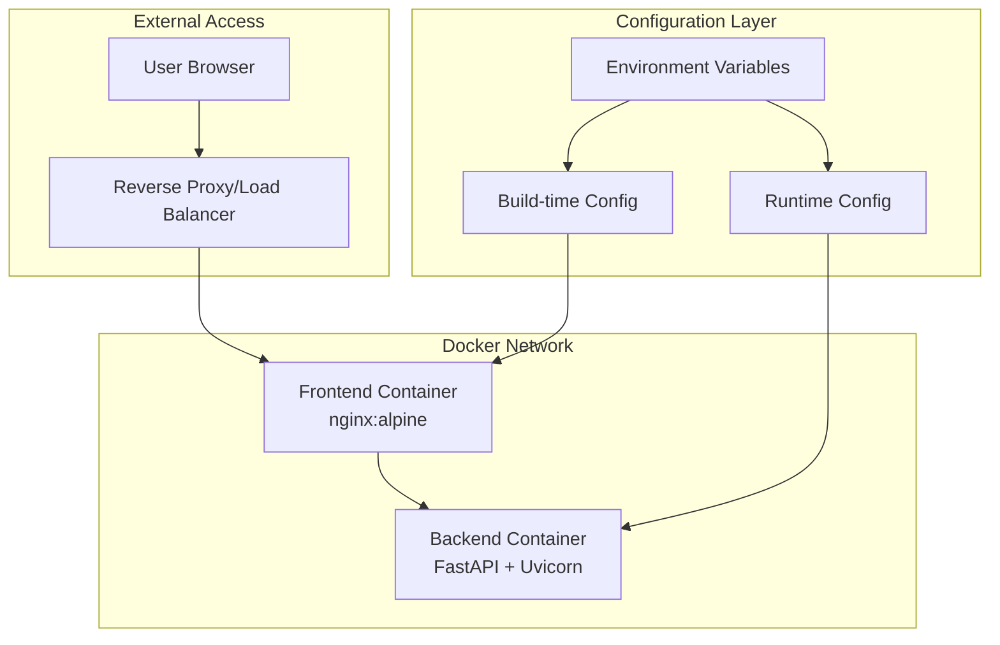
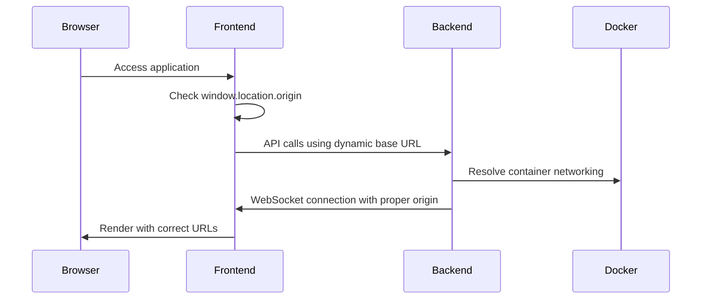

# Design Document

## Overview

This design transforms the multiplayer trivia game from a development-focused application with hardcoded localhost references into a production-ready system that automatically configures URLs and connections based on the deployment environment. The solution uses environment variables, dynamic URL generation, and proper Docker networking to ensure the application works correctly when deployed via docker-compose without manual configuration changes.

## Architecture

### Current Problem Analysis

The application currently has hardcoded localhost references in:
- Frontend API calls to backend
- WebSocket connection URLs
- CORS configuration
- Docker container communication

### Solution Architecture



### URL Resolution Strategy



## Components and Interfaces

### 1. Environment Configuration System

#### Environment Variables Structure
```bash
# Production Environment Variables
NODE_ENV=production
REACT_APP_API_URL=auto  # Auto-detect from window.location
REACT_APP_WS_URL=auto   # Auto-detect from window.location
BACKEND_HOST=0.0.0.0
BACKEND_PORT=8000
FRONTEND_PORT=80
CORS_ORIGINS=*  # Or specific domains for production
```

#### Configuration Resolution Logic
```javascript
// Frontend: src/config/api.js
const getApiConfig = () => {
  const isDevelopment = process.env.NODE_ENV === 'development';
  
  if (isDevelopment) {
    return {
      apiUrl: 'http://localhost:8000',
      wsUrl: 'ws://localhost:8000'
    };
  }
  
  // Production: Use current origin
  const protocol = window.location.protocol === 'https:' ? 'https:' : 'http:';
  const wsProtocol = window.location.protocol === 'https:' ? 'wss:' : 'ws:';
  const host = window.location.host;
  
  return {
    apiUrl: `${protocol}//${host}/api`,
    wsUrl: `${wsProtocol}//${host}/ws`
  };
};
```

### 2. Docker Configuration Updates

#### Updated docker-compose.yml
```yaml
version: '3.8'

services:
  backend:
    build: ./backend
    container_name: trivia_backend
    environment:
      - HOST=0.0.0.0
      - PORT=8000
      - CORS_ORIGINS=*
    expose:
      - "8000"
    networks:
      - trivia_network

  frontend:
    build: ./frontend
    container_name: trivia_frontend
    ports:
      - "80:80"
    depends_on:
      - backend
    networks:
      - trivia_network

networks:
  trivia_network:
    driver: bridge
```

#### Frontend Dockerfile Updates
```dockerfile
# Multi-stage build for production
FROM node:18-alpine as build

WORKDIR /app
COPY package*.json ./
RUN npm ci --only=production

COPY . .
RUN npm run build

FROM nginx:alpine
COPY --from=build /app/build /usr/share/nginx/html
COPY nginx.conf /etc/nginx/conf.d/default.conf

EXPOSE 80
CMD ["nginx", "-g", "daemon off;"]
```

#### Nginx Configuration for API Proxying
```nginx
server {
    listen 80;
    server_name _;
    
    # Serve React app
    location / {
        root /usr/share/nginx/html;
        index index.html index.htm;
        try_files $uri $uri/ /index.html;
    }
    
    # Proxy API requests to backend
    location /api/ {
        proxy_pass http://backend:8000/;
        proxy_http_version 1.1;
        proxy_set_header Upgrade $http_upgrade;
        proxy_set_header Connection 'upgrade';
        proxy_set_header Host $host;
        proxy_set_header X-Real-IP $remote_addr;
        proxy_set_header X-Forwarded-For $proxy_add_x_forwarded_for;
        proxy_set_header X-Forwarded-Proto $scheme;
        proxy_cache_bypass $http_upgrade;
    }
    
    # Proxy WebSocket connections
    location /ws/ {
        proxy_pass http://backend:8000/ws/;
        proxy_http_version 1.1;
        proxy_set_header Upgrade $http_upgrade;
        proxy_set_header Connection "upgrade";
        proxy_set_header Host $host;
        proxy_set_header X-Real-IP $remote_addr;
        proxy_set_header X-Forwarded-For $proxy_add_x_forwarded_for;
        proxy_set_header X-Forwarded-Proto $scheme;
    }
}
```

### 3. Backend Configuration Updates

#### Dynamic CORS Configuration
```python
# backend/app/main.py
import os
from fastapi import FastAPI
from fastapi.middleware.cors import CORSMiddleware

app = FastAPI()

# Dynamic CORS configuration
cors_origins = os.getenv("CORS_ORIGINS", "*").split(",")
if cors_origins == ["*"]:
    # Allow all origins in development or when explicitly set
    allow_origins = ["*"]
else:
    allow_origins = [origin.strip() for origin in cors_origins]

app.add_middleware(
    CORSMiddleware,
    allow_origins=allow_origins,
    allow_credentials=True,
    allow_methods=["*"],
    allow_headers=["*"],
)
```

#### WebSocket Origin Validation
```python
# backend/app/websocket.py
import os
from fastapi import WebSocket, WebSocketDisconnect
from urllib.parse import urlparse

async def websocket_endpoint(websocket: WebSocket, session_id: str):
    # Validate origin in production
    if os.getenv("NODE_ENV") == "production":
        origin = websocket.headers.get("origin")
        if origin:
            # Allow same-origin requests
            parsed_origin = urlparse(origin)
            # Add additional origin validation logic if needed
    
    await websocket.accept()
    # ... rest of WebSocket logic
```

### 4. Frontend URL Management

#### API Client Configuration
```javascript
// src/services/api.js
import { getApiConfig } from '../config/api';

class ApiClient {
  constructor() {
    const config = getApiConfig();
    this.baseURL = config.apiUrl;
    this.wsURL = config.wsUrl;
  }
  
  async request(endpoint, options = {}) {
    const url = `${this.baseURL}${endpoint}`;
    const response = await fetch(url, {
      headers: {
        'Content-Type': 'application/json',
        ...options.headers,
      },
      ...options,
    });
    
    if (!response.ok) {
      throw new Error(`API request failed: ${response.status}`);
    }
    
    return response.json();
  }
  
  createWebSocket(endpoint) {
    const url = `${this.wsURL}${endpoint}`;
    return new WebSocket(url);
  }
}

export const apiClient = new ApiClient();
```

#### WebSocket Connection Manager
```javascript
// src/services/websocket.js
import { getApiConfig } from '../config/api';

class WebSocketManager {
  constructor() {
    this.config = getApiConfig();
    this.connection = null;
    this.reconnectAttempts = 0;
    this.maxReconnectAttempts = 5;
  }
  
  connect(sessionId, playerId) {
    const wsUrl = `${this.config.wsUrl}/ws/${sessionId}/${playerId}`;
    
    try {
      this.connection = new WebSocket(wsUrl);
      this.setupEventHandlers();
    } catch (error) {
      console.error('WebSocket connection failed:', error);
      this.handleReconnect();
    }
  }
  
  setupEventHandlers() {
    this.connection.onopen = () => {
      console.log('WebSocket connected');
      this.reconnectAttempts = 0;
    };
    
    this.connection.onerror = (error) => {
      console.error('WebSocket error:', error);
    };
    
    this.connection.onclose = () => {
      console.log('WebSocket disconnected');
      this.handleReconnect();
    };
  }
  
  handleReconnect() {
    if (this.reconnectAttempts < this.maxReconnectAttempts) {
      this.reconnectAttempts++;
      const delay = Math.pow(2, this.reconnectAttempts) * 1000;
      setTimeout(() => this.connect(), delay);
    }
  }
}

export const wsManager = new WebSocketManager();
```

## Dice Functionality Fix

### Current Problem
The dice functionality currently auto-submits questions instead of filling the admin fields for review.

### Solution Design

#### Updated Dice Component Behavior
```javascript
// src/components/dice/DiceQuestionSelector.js
const DiceQuestionSelector = ({ onQuestionSelected, isGameMaster }) => {
  const [isRolling, setIsRolling] = useState(false);
  const [selectedQuestion, setSelectedQuestion] = useState(null);
  
  const handleDiceClick = async () => {
    if (!isGameMaster) return;
    
    setIsRolling(true);
    
    try {
      // Get random question from backend
      const response = await apiClient.request('/dice-question', {
        method: 'POST',
        body: JSON.stringify({ sessionId: currentSession.id })
      });
      
      const { question, answer } = response;
      
      // Fill admin fields instead of auto-submitting
      onQuestionSelected({
        question,
        answer,
        source: 'dice',
        isEditable: true
      });
      
      setSelectedQuestion({ question, answer });
    } catch (error) {
      console.error('Failed to get dice question:', error);
    } finally {
      setIsRolling(false);
    }
  };
  
  return (
    <div className="dice-selector">
      <button 
        onClick={handleDiceClick}
        disabled={isRolling || !isGameMaster}
        className="dice-button"
      >
        {isRolling ? '🎲 Rolling...' : '🎲 Random Question'}
      </button>
      
      {selectedQuestion && (
        <div className="dice-result">
          <p>✅ Question loaded! Review and edit before submitting.</p>
        </div>
      )}
    </div>
  );
};
```

#### Game Master Panel Integration
```javascript
// src/components/GameMasterPanel.js
const GameMasterPanel = () => {
  const [questionText, setQuestionText] = useState('');
  const [answerText, setAnswerText] = useState('');
  const [questionSource, setQuestionSource] = useState('manual');
  
  const handleDiceQuestionSelected = ({ question, answer, source }) => {
    // Fill the form fields instead of auto-submitting
    setQuestionText(question);
    setAnswerText(answer);
    setQuestionSource(source);
    
    // Show visual feedback
    showNotification('Random question loaded! Review and edit before submitting.');
  };
  
  const handleSubmitQuestion = async () => {
    // Manual submission after review
    try {
      await apiClient.request('/submit-question', {
        method: 'POST',
        body: JSON.stringify({
          sessionId: currentSession.id,
          question: questionText,
          answer: answerText,
          source: questionSource
        })
      });
      
      // Clear form after successful submission
      setQuestionText('');
      setAnswerText('');
      setQuestionSource('manual');
      
    } catch (error) {
      console.error('Failed to submit question:', error);
    }
  };
  
  return (
    <div className="game-master-panel">
      <DiceQuestionSelector onQuestionSelected={handleDiceQuestionSelected} />
      
      <form onSubmit={handleSubmitQuestion}>
        <div className="form-group">
          <label>Question:</label>
          <textarea
            value={questionText}
            onChange={(e) => setQuestionText(e.target.value)}
            placeholder="Enter your question..."
            required
          />
        </div>
        
        <div className="form-group">
          <label>Correct Answer:</label>
          <input
            type="text"
            value={answerText}
            onChange={(e) => setAnswerText(e.target.value)}
            placeholder="Enter the correct answer..."
            required
          />
        </div>
        
        {questionSource === 'dice' && (
          <div className="source-indicator">
            🎲 This question was randomly selected. You can edit it before submitting.
          </div>
        )}
        
        <button type="submit" className="submit-button">
          Submit Question to Players
        </button>
      </form>
    </div>
  );
};
```

## Data Models

### Configuration Models
```javascript
// Frontend configuration structure
const AppConfig = {
  environment: 'production' | 'development',
  api: {
    baseUrl: string,
    wsUrl: string,
    timeout: number
  },
  features: {
    autoReconnect: boolean,
    maxReconnectAttempts: number
  }
};
```

### Backend Configuration
```python
# backend/app/config.py
from pydantic import BaseSettings

class Settings(BaseSettings):
    host: str = "0.0.0.0"
    port: int = 8000
    cors_origins: str = "*"
    environment: str = "production"
    log_level: str = "INFO"
    
    class Config:
        env_file = ".env"

settings = Settings()
```

## Error Handling

### Network Configuration Errors
- **Invalid CORS Configuration**: Clear error messages and fallback to permissive settings in development
- **WebSocket Connection Failures**: Automatic retry with exponential backoff
- **API Endpoint Resolution**: Fallback to localhost in development environments

### Dice Functionality Errors
- **No Questions Available**: Clear message and option to upload CSV or enter manual question
- **Question Loading Failures**: Retry mechanism and fallback to manual entry
- **Form Validation**: Ensure edited dice questions meet requirements before submission

## Testing Strategy

### Configuration Testing
- **Environment Detection**: Test URL resolution in different deployment scenarios
- **Docker Networking**: Verify container-to-container communication
- **CORS Configuration**: Test cross-origin requests in production setup

### Dice Functionality Testing
- **Form Population**: Verify dice questions fill fields correctly
- **Edit Capability**: Test question/answer editing before submission
- **Manual Submission**: Confirm questions are only submitted when user clicks submit

### Integration Testing
- **Full Docker Compose**: Test complete application deployment
- **Production Simulation**: Test with different server IPs and domains
- **WebSocket Connectivity**: Verify real-time features work in production setup